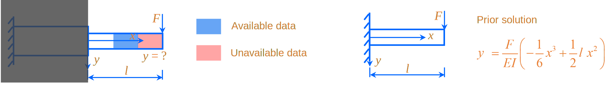
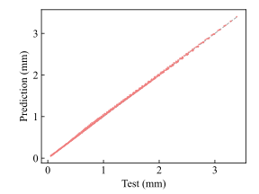
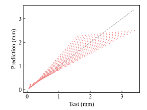

<br>

---

# Welcome to use SGML! 

---

<br>
<br>

# 1 Introduction

   Solution-guided machine learning (SGML) is a universal approach designed to enhance the extrapolation capabilities of AI models, as detailed in the paper [*Thin-Walled Struct.* 200 (2024) 111984]. To simplify the integration of this method into diverse projects, we have encapsulated it within a user-friendly Python package. By leveraging the functions provided in the package, users can effortlessly apply the SGML method to enhance the extrapolation capabilities of their AI models.

   The current version of the package incorporates various regression models, including implementations for Artificial Neural Network, Support Vector Regression, AdaBoost Regression, Bayesian Ridge Regression, and Ridge Regression models. It's worth noting that we are actively working to expand the package's capabilities, and future releases will introduce additional models to further enhance its universality and applicability to a broader range of AI projects.

<br>
<br>

# 2 Preparation

- The functionality of this package depends on the following external libraries: 

&nbsp;&nbsp;&nbsp;&nbsp;&nbsp;&nbsp;&nbsp;&nbsp;[](https://pandas.pydata.org/)
&nbsp;&nbsp;&nbsp;&nbsp;&nbsp;[](https://numpy.org/)
&nbsp;&nbsp;&nbsp;&nbsp;&nbsp;[](https://matplotlib.org/)
&nbsp;&nbsp;&nbsp;&nbsp;&nbsp;[](https://pypi.org/project/joblib/)
&nbsp;&nbsp;&nbsp;&nbsp;&nbsp;[](https://pypi.org/project/tqdm/)
&nbsp;&nbsp;&nbsp;&nbsp;&nbsp;[](https://pytorch.org/)
&nbsp;&nbsp;&nbsp;&nbsp;&nbsp;[](https://scikit-learn.org/stable/index.html)

- You can easily install SGML using the following command:

  `pip install SGML`

- The required project data is in .csv format, displayed in the table below, with the column index encompassing the features and labels necessary for machine learning. 
  
   | ID | x1 | x2 | ... | y |
   |---|---|---|---|---|
   | 1 | ... | ... | ... | ... |
   | 2 | ... | ... | ... | ... |
   | ... | ... | ... | ... | ... |

<br>
<br>

# 3 API

> [!IMPORTANT]
> - The solution function will be returned with the data type of a *function* for the given solution. Users can assign it a name for subsequent guidance in machine learning. 
>
> - When the parameters are set to *`'default'`* or left unspecified, the default values for those parameters will be applied. 
>
> - Once you have defined your chosen model, remember to utilize additional modules for training and further analysis. 

<br>

## 3.1 Solution Function

*def* **SGML.create_solution_function(**

*`expression`* = *str*, 
                                           
*`variables`* = *list* 

**)**

*return* *function*

> [!TIP]
> *`expression`* : Solution expression, such as *`'a**3+2*b+1'`*.
>                                          
> *`variables`* : List of variables included in the solution，such as *`['a', 'b']`*.

<br>

## 3.2 Artificial Neural Network-based Model

*class* **SGML.ann(**

*`train_path`* = *str*, 

*`test_path`* = *str*, 

*`feature_names`* = *list*, 

*`lable_names`* = *list*, 

*`solution_functions`* = *list*, 

*`model_loadpath`* = *str*, 

*`model_savepath`* = *str*, 

*`hidden_layers`* = *list*, 

*`activation_function`*  = *object*, 

*`batch_size`* = *int*, 

*`criterion`* = *object*, 

*`optimizer`* = *object*, 

*`learning_rate`*  = *float*, 

*`epochs`*  = *int* 

**)**

> [!TIP]
> *`train_path`* : The file path for loading the training set. 
>
> *`test_path`* : The file path for loading the testing set. 
>
> *`feature_names`* : List containing feature names, such as *`['x1', 'x2', ...]`*. 
>
> *`lable_names`* : List containing label names, such as *`['y']`*. 
>
> *`solution_functions`* : List containing solution function names, such as *`[solution1, solution2, ...]`*. *`default=None`* 
>
> *`model_loadpath`* : The file path for the existing model. *`default=None`* 
>
> *`model_savepath`* : Path to save the model. *`default=None`* 
>
> *`hidden_layers`* : The hidden layer architecture, denoted as *`[4, 8, 2]`*, signifies the presence of three hidden layers with node counts of 4, 8, and 2, respectively. *`default=[8, 8]`* 
>
> *`activation_function`* : The activation function—refer to [PyTorch Documentation](https://pytorch.org/docs/stable/index.html) for details. *`default=torch.nn.PReLU()`* 
>
> *`batch_size`* : The number of training samples used by the model during each parameter update. *`default=Total number of samples`* 
>
> *`criterion`* : The loss function—refer to [PyTorch Documentation](https://pytorch.org/docs/stable/index.html) for details. *`default=torch.nn.MSELoss()`* 
>
> *`optimizer`* : The optimizer—refer to [PyTorch Documentation](https://pytorch.org/docs/stable/index.html) for details. *`default=torch.optim.Adam()`* 
>
> *`learning_rate`* : *`default=0.01`* 
>
> *`epochs`* : *`default=5000`* 

<br>

## 3.3 Support Vector Regression-based Model

*class* **SGML.svr(**

*`train_path`* = *str*, 

*`test_path`* = *str*, 

*`feature_names`* = *list*, 

*`lable_names`* = *list*, 

*`solution_functions`* = *list*, 

*`model_loadpath`* = *str*, 

*`model_savepath`* = *str*, 

*`kernel`* = *str*, 

*`degree`* = *int*, 

*`gamma`* = *str* or *float*, 

*`coef0`* = *float*, 

*`tol`* = *float*, 

*`C`* = *float*, 

*`epsilon`* = *float*, 

*`shrinking`* = *bool*, 

*`cache_size`* = *float*, 

*`verbose`* = *bool*, 

*`max_iter`* = *int* 

**)**

> [!TIP]
> The API reference for the parameters *`train_path`*, *`test_path`*, *`feature_names`*, *`lable_names`*, *`solution_functions`*, *`model_loadpath`*, and *`model_savepath`* can be found in Section 3.2.
>
> *`kernel`* : Refer to [sklearn.svm.SVR](https://scikit-learn.org/stable/modules/generated/sklearn.svm.SVR.html) for detailed information, and the same applies to the following parameters. *`default='linear'`*
>
> *`degree`* : *`default=3`* 
>
> *`gamma`* : *`default='scale'`* 
>
> *`coef0`* : *`default=0.0`* 
>
> *`tol`* : *`default=1e-3`* 
>
> *`C`* : *`default=1.0`* 
>
> *`epsilon`* : *`default=0.1`* 
>
> *`shrinking`* : *`default=True`* 
>
> *`cache_size`* : *`default=200`* 
>
> *`verbose`* : *`default=False`* 
>
> *`max_iter`* : *`default=-1`*

<br>

## 3.4 AdaBoost Regressor-based Model

*class* **SGML.adaboost(**

*`train_path`* = *str*, 

*`test_path`* = *str*, 

*`feature_names`* = *list*, 

*`lable_names`* = *list*, 

*`solution_functions`* = *list*, 

*`model_loadpath`* = *str*, 

*`model_savepath`* = *str*, 

*`estimator`* = *object*,

*`n_estimators`* = *int*,

*`learning_rate`* = *float*,

*`loss`* = *str*,

*`random_state`* = *int*

**)**

> [!TIP]
> The API reference for the parameters *`train_path`*, *`test_path`*, *`feature_names`*, *`lable_names`*, *`solution_functions`*, *`model_loadpath`*, and *`model_savepath`* can be found in Section 3.2.
>
> *`estimator`* : Refer to [sklearn.ensemble.AdaBoostRegressor](https://scikit-learn.org/stable/modules/generated/sklearn.ensemble.AdaBoostRegressor.html) for detailed information, and the same applies to the following parameters. *`default=LinearRegression()`*
>
> *`n_estimators`* : *`default=50`* 
>
> *`learning_rate`* : *`default=1.0`* 
>
> *`loss`* : *`default='linear'`* 
>
> *`random_state`* : *`default=None`* 

<br>

## 3.5 BayesianRidge Regressor-based Model

*class* **SGML.bayesianridge(**

*`train_path`* = *str*, 

*`test_path`* = *str*, 

*`feature_names`* = *list*, 

*`lable_names`* = *list*, 

*`solution_functions`* = *list*, 

*`model_loadpath`* = *str*, 

*`model_savepath`* = *str*, 

*`max_iter`* = *int*, 

*`tol`* = *float*, 

*`alpha_1`* = *float*, 

*`alpha_2`* = *float*, 

*`lambda_1`* = *float*, 

*`lambda_2`* = *float*, 

*`alpha_init`* = *float*, 

*`lambda_init`* = *float*, 

*`compute_score`* = *bool*, 

*`fit_intercept`* = *bool*, 

*`copy_X`* = *bool*, 

*`verbose`* = *bool* 

**)**

> [!TIP]
> The API reference for the parameters *`train_path`*, *`test_path`*, *`feature_names`*, *`lable_names`*, *`solution_functions`*, *`model_loadpath`*, and *`model_savepath`* can be found in Section 3.2.
>
> *`max_iter`* : Refer to [sklearn.linear_model.BayesianRidge](https://scikit-learn.org/stable/modules/generated/sklearn.linear_model.BayesianRidge.html) for detailed information, and the same applies to the following parameters. *`default=None`*
>
> *`tol`* : *`default=1e-3`* 
>
> *`alpha_1`* : *`default=1e-6`* 
>
> *`alpha_2`* : *`default=1e-6`* 
>
> *`lambda_1`* : *`default=1e-6`* 
>
> *`lambda_2`* : *`default=1e-6`* 
>
> *`alpha_init`* : *`default=None`* 
>
> *`lambda_init`* : *`default=None`* 
>
> *`compute_score`* : *`default=False`* 
>
> *`fit_intercept`* : *`default=True`* 
>
> *`copy_X`* : *`default=True`*
>
> *`verbose`* : *`default=False`*

<br>

## 3.6 Ridge Regressor-based Model

*class* **SGML.ridge(**

*`train_path`* = *str*, 

*`test_path`* = *str*, 

*`feature_names`* = *list*, 

*`lable_names`* = *list*, 

*`solution_functions`* = *list*, 

*`model_loadpath`* = *str*, 

*`model_savepath`* = *str*, 

*`alpha`* = *float*, 

*`fit_intercept`* = *bool*, 

*`copy_X`* = *str* or *bool*, 

*`max_iter`* = *int*, 

*`tol`* = *float*, 

*`solver`* = *str*, 

*`positive`* = *bool*, 

*`random_state`* = *int* 

**)**

> [!TIP]
> The API reference for the parameters *`train_path`*, *`test_path`*, *`feature_names`*, *`lable_names`*, *`solution_functions`*, *`model_loadpath`*, and *`model_savepath`* can be found in Section 3.2.
>
> *`alpha`* : Refer to [sklearn.linear_model.Ridge](https://scikit-learn.org/stable/modules/generated/sklearn.linear_model.Ridge.html) for detailed information, and the same applies to the following parameters. *`default=1.0`*
>
> *`fit_intercept`* : *`default=True`* 
>
> *`copy_X`* : *`default=True`* 
>
> *`max_iter`* : *`default=None`* 
>
> *`tol`* : *`default=1e-4`* 
>
> *`solver`* : *`default='auto'`* 
>
> *`positive`* : *`default=False`* 
>
> *`random_state`* : *`default=None`* 

<br>
<br>

# 4 Example

As depicted in the figure below, considering that the fixed end of a cantilever beam is obscured, force-deflection data can be experimentally obtained from the visible end. Our objective is to leverage machine learning to glean insights from this data and predict deflection at higher forces in different locations. Interestingly, by treating the occluded part as a wall, we can readily calculate the deflection of the new cantilever beam, providing valuable guidance for machine learning applications. 



Assuming $l=0.3 m$, $E=210 GPa$, $I=180 m^{-4}\$. We will proceed to address this problem using the *`SGML.ann()`* module, and the corresponding code and results are presented below: 

```
import SGML

# Define the solution function

solution_1 = SGML.create_solution_function(expression='F * (-1 / 6 * x ** 3 + 1 / 2 * 0.3 * x ** 2) / (2100 * 180)',
                                           variables=['F', 'x'])


# Call the SGML.ann() module for training

my_ann, y_test, y_pre = SGML.ann(train_path='./bending_train1.csv',
                                 test_path='./bending_test1.csv',
                                 feature_names=['F', 'x'],
                                 lable_names=['y'],
                                 solution_functions=[solution_1],
                                 model_loadpath='default',
                                 model_savepath='default',
                                 hidden_layers='default',
                                 activation_function='default',
                                 batch_size='default',
                                 criterion='default',
                                 optimizer='default',
                                 learning_rate='default',
                                 epochs='default')
```



The required data for this example is readily available within the package. For comparison, we set *`solution_functions=None`* (indicating conventional machine learning), retrain, and present the prediction results below. 


